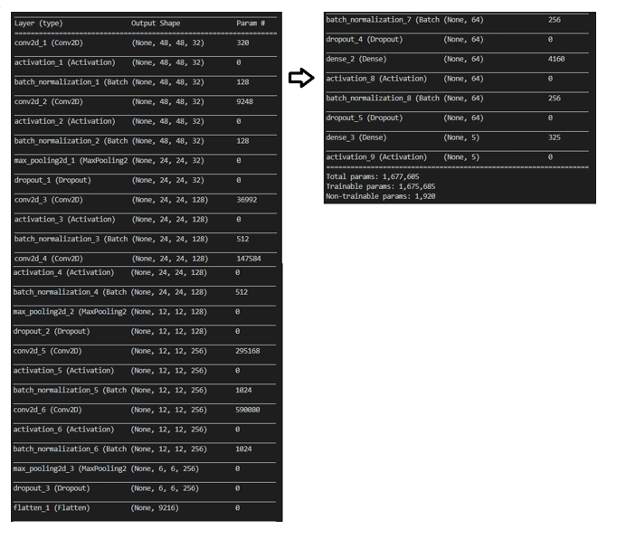

# Emotion-based Movie Recommendation System

# Getting Started

This repository containts the deployed version of An EMRS using [Django](https://www.djangoproject.com/). It can detect and classify face expressions and suggest movies according to the detected emotion ...

# The Used Model



## Running Locally

The libraries used are in requirement.txt.
```sh
$ git clone https://github.com/medaharrat/EMRS.git
$ cd app
$ pip install -r requirements.txt
$ py manage.py runserver
```
The app should be running on [localhost:8080](http://localhost:8080/)

###### Notice : You might encounter a problem regarding Tensorflow, do please open tensorflow_backend.py file and comment lines 73, 76 and 77 from the file located at "\Anaconda3\Lib\site-packages\keras\backend\tensorflow_backend.py", if you do not do this you'll get a "_thread._local' object has no attribute 'value' " error.
